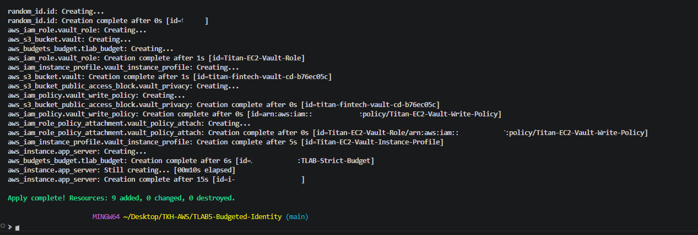
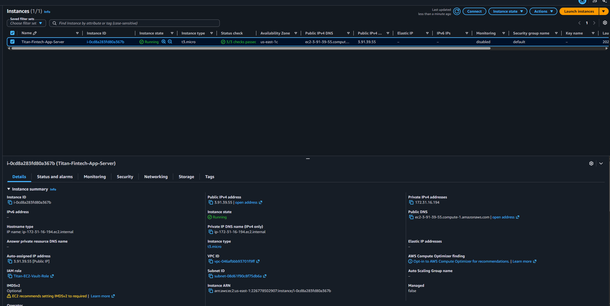
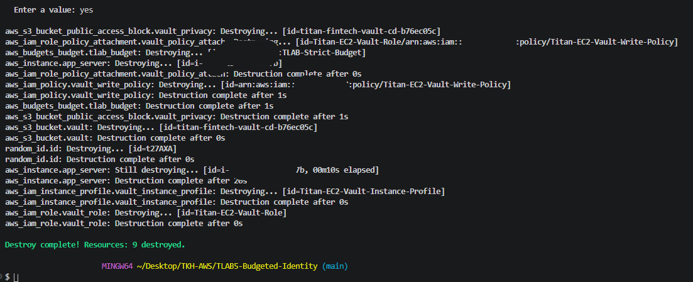

# 📸 The Budgeted Identity — Technical Evidence

This directory contains the verified technical evidence demonstrating the successful deployment, IAM role audit, and programmatic teardown of our secure, budgeted AWS cloud-native infrastructure.

---

### 🚀 Automated Cloud Provisioning Verification
**File:** `build_success.png`  
**Target:** Terraform CLI Execution Output (`terraform apply`)

* **Defensive Mechanism:** Infrastructure as Code (IaC) Deployment Validation.
* **Action:** Executed `terraform apply` to compile and deploy our declarative blueprint.
* **Result:** Successfully built and provisioned all secure resources—including S3 data vaults, dynamic IAM custom roles, instance profiles, and EC2 computing resources—with zero runtime or syntax errors.
* **Significance:** Validates that cloud architecture can be repeatably built from empty states into highly secure environments in under two minutes without manual errors.

---

### 🔐 Least-Privilege Identity & Trust Verification
**File:** `security_audit.png`  
**Target:** AWS Management Console EC2 Instance Security Portal

* **Defensive Mechanism:** Role-Based Access Control (RBAC) & Trust Delegation.
* **Action:** Inspected the live metadata properties of the running `Titan-Fintech-App-Server` to verify its active security identity profile.
* **Result:** Confirmed the server is actively running under the `Titan-EC2-Vault-Role` via the associated AWS IAM Instance Profile.
* **Significance:** Proves that credentials are dynamically traded via AWS STS instead of being hardcoded inside configuration files. The instance has successfully transitioned from dangerous legacy wildcard privileges to surgical, write-only S3 folder boundaries.

---

### 💳 Lifecycle Teardown & Cost Containment Verification
**File:** `destroy_verification.png`  
**Target:** Terraform CLI Destruction Output (`terraform destroy`)

* **Defensive Mechanism:** Programmatic Financial Decommissioning.
* **Action:** Triggered a global infrastructure teardown (`terraform destroy`) to ensure no orphan components or hidden micro-costs persisted.
* **Result:** Successfully destroyed all provisioned cloud resources, yielding a clean terminal confirmation: `Destroy complete! Resources: X destroyed.`
* **Significance:** Demonstrates absolute lifecycle control, mitigating the risk of cloud resource abandonment and proving tight cost governance to safeguard our active project stipend.

---

## 🛡️ Defensible Remediation Guidelines Tested
Based on the architectural deployment validated in this evidence, the following defense-in-depth principles are fully realized:
1. **Financial Denial-of-Wallet Block:** Monthly cost metrics are actively governed by a programmatic $10.00 limits firewall, alerting engineering personnel at 80% usage before critical resources are exhausted.
2. **Elimination of Long-Lived API Keys:** By binding the IAM policy directly to an Instance Profile, our compute hosts authenticate natively, ensuring an OS-level compromise will not leak permanent system access keys.
3. **Storage Public Exposure Prevention:** S3 resources are created default-private, blocking public bucket policy configurations out-of-the-box to eradicate manual bucket leakage oversights.
