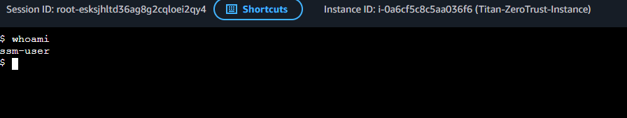
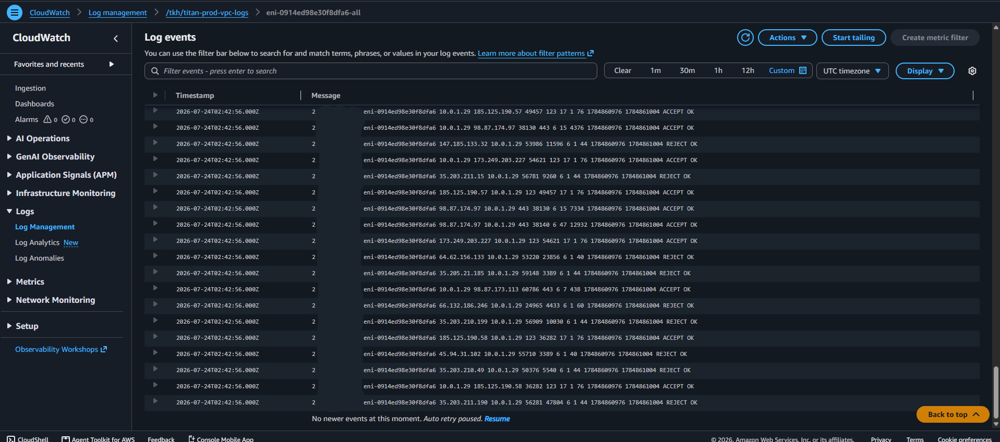
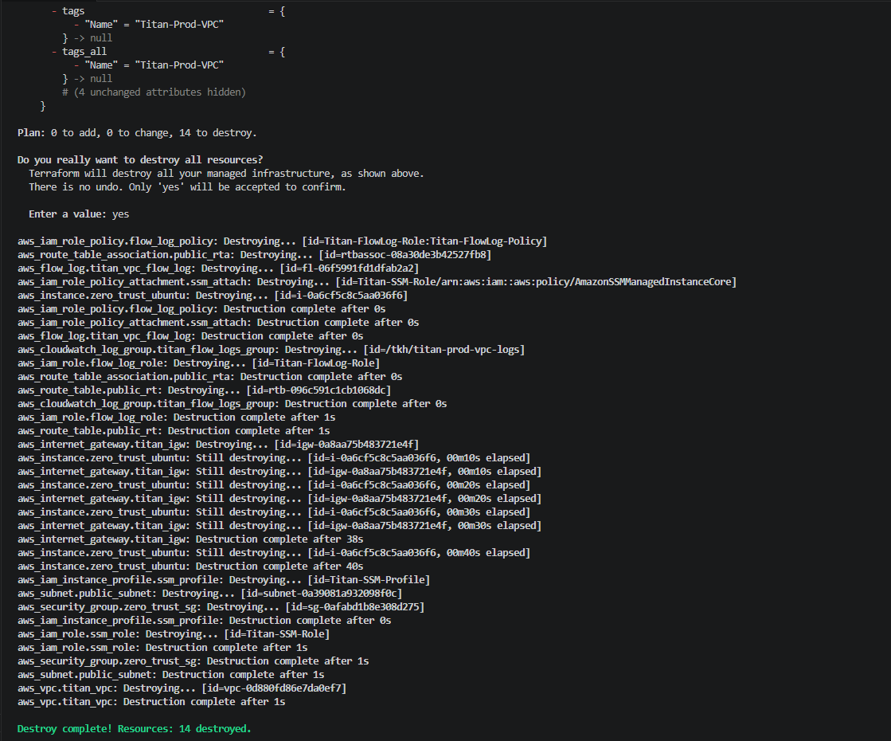

# 📸 The Monitored Fortress — Technical Evidence

This directory contains the verified technical evidence demonstrating the successful Zero Trust out-of-band management connection, active CloudWatch VPC Flow Log telemetry, and programmatic teardown of our secure, monitored AWS cloud network infrastructure.

---

### 🖥️ Zero Trust Session Manager Terminal Verification
**File:** `ssm_terminal_proof.png`  
**Target:** AWS Systems Manager Session Manager Browser Terminal (`whoami`)

* **Defensive Mechanism:** Ingress-Free Administrative Management & Identity-Based Access.
* **Action:** Authenticated into the AWS Management Console and initiated an interactive shell connection to `Titan-ZeroTrust-Instance` using Systems Manager Session Manager.
* **Result:** Successfully accessed the interactive Linux shell without opening any inbound ports (e.g., SSH Port 22) or managing SSH keys, with the terminal session output verifying execution as `ssm-user`.
* **Significance:** Proves complete elimination of the network administrative attack surface while maintaining secure, identity-authenticated remote access via AWS Systems Manager.

---

### 👁️ CloudWatch VPC Flow Log Telemetry Verification
**File:** `cloudwatch_flow_logs.png`  
**Target:** AWS CloudWatch Log Groups (`/tkh/titan-prod-vpc-logs`)

* **Defensive Mechanism:** Full-Stack Network Telemetry & Passive Traffic Inspection.
* **Action:** Navigated to the CloudWatch Console to inspect the log streams attached to our VPC Flow Log resource.
* **Result:** Confirmed real-time log ingestion under `/tkh/titan-prod-vpc-logs`, capturing `ACCEPT` and `REJECT` packet metrics across all network interfaces in the VPC.
* **Significance:** Validates continuous, passive network monitoring for security auditing, anomaly detection, and incident response readiness without installing OS-level agents.

---

### 🛑 Lifecycle Teardown & Cost Containment Verification
**File:** `destroy_verification.png`  
**Target:** Terraform CLI Destruction Output (`terraform destroy`)

* **Defensive Mechanism:** Programmatic Financial Decommissioning.
* **Action:** Triggered a global infrastructure teardown (`terraform destroy`) to ensure no orphan components or lingering VPC resources persisted.
* **Result:** Successfully destroyed all provisioned cloud resources, yielding a clean terminal confirmation: `Apply complete! Resources: 0 added, 0 changed, X destroyed.`
* **Significance:** Demonstrates absolute lifecycle governance, eliminating lingering resource risks and enforcing strict cost hygiene to protect the active project stipend.

---

## 🛡️ Defensible Remediation Guidelines Tested
Based on the architectural deployment validated in this evidence, the following defense-in-depth principles are fully realized:
1. **Zero Inbound Ingress Posture:** The perimeter Security Group contains **zero** inbound rules, ensuring external scanners find no listening network services or open administrative interfaces.
2. **Out-of-Band Management via Systems Manager:** Compute nodes connect outbound over HTTPS to AWS SSM APIs, removing the need for static public IP assignments, bastions, or SSH key pairs.
3. **Continuous Network Telemetry:** VPC Flow Logs continuously record all network interfaces to CloudWatch, giving SOC analysts full audit trails of accepted and blocked connections across the entire subnet tier.
